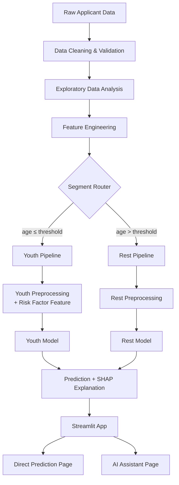

<div align="center">

# 🩺 Pulse Health — AI-Powered Insurance Premium Prediction

### *Predictive Care. Precise Coverage.*

An end-to-end, production-grade machine learning system that predicts health insurance premiums in real time — built through the complete ML lifecycle, from business charter to a live, segmented, self-correcting model architecture.

[](https://www.python.org/)
[](#-live-demo)
[](#-tech-stack)
[](#-license)
[](#-the-story-how-this-model-evolved)
[](#)

**[🚀 Live Demo](#-live-demo) · [📖 The Story](#-the-story-how-this-model-evolved) · [🏗️ Architecture](#️-system-architecture) · [📊 Results](#-model-performance) · [⚙️ Setup](#️-installation--setup)**

</div>

---

## 🖼️ Preview

<div align="center">

| Direct Prediction | AI Assistant |
|:---:|:---:|
| _[screenshot placeholder — add yours]_ | _[screenshot placeholder — add yours]_ |

</div>

---

## 📋 Table of Contents

- [Overview](#-overview)
- [Key Highlights](#-key-highlights)
- [Live Demo](#-live-demo)
- [The Story: How This Model Evolved](#-the-story-how-this-model-evolved)
- [System Architecture](#️-system-architecture)
- [Dataset](#️-dataset)
- [Methodology](#-methodology)
- [Model Performance](#-model-performance)
- [Explainability](#-explainability)
- [Tech Stack](#-tech-stack)
- [Repository Structure](#-repository-structure)
- [Installation & Setup](#️-installation--setup)
- [Usage](#-usage)
- [Project Management](#️-project-management)
- [Testing](#-testing)
- [CI/CD](#-cicd)
- [Roadmap](#️-roadmap)
- [Lessons Learned](#-lessons-learned)
- [Contributing](#-contributing)
- [License](#-license)
- [Acknowledgments](#-acknowledgments)
- [Contact](#-contact)

---

## 🎯 Overview

Pulse Health is a health insurance provider whose underwriters priced individual policies using manual, actuarial-table-driven calculations — slow, inconsistent across underwriters, and hard to scale as application volume grows.

This project delivers a machine-learning system that gives underwriters an **instant, consistent, and explainable** premium estimate from applicant risk factors — deployed as a live, cloud-hosted application rather than a notebook that never leaves someone's laptop.

What makes this different from a typical "predict insurance premiums" project isn't the core ML — it's everything around it: a full project management lifecycle (Charter, SOW, BRD/FRD, Jira-tracked delivery), a **post-launch discovery that led to a real architectural iteration**, and a deployment with two distinct, purpose-built user interfaces.

## ✨ Key Highlights

- 🏢 **Full project lifecycle** — Project Charter, Scope of Work, Business & Functional Requirements, and a Jira-tracked backlog, not just a notebook
- 🧠 **Stacked ensemble modeling** — XGBoost, LightGBM, and Random Forest as base learners, combined via a Ridge meta-model
- 🔍 **Real post-launch discovery** — subgroup error analysis revealed a systematic weakness for younger applicants *after* the first version was live, not before
- 🧬 **Segmented model architecture (v2)** — independently trained, independently versioned pipelines routed by applicant segment, each with its own preprocessing and feature set
- 💬 **Two deployment interfaces** — a direct-input form for speed, and a conversational AI assistant that collects inputs turn-by-turn for a friendlier underwriting experience
- 🔬 **SHAP-based explainability** — both global feature importance and per-prediction local explanations, because "trust me" isn't good enough for a pricing decision
- 🧪 **Regression-tested iteration** — v2 was validated against v1 on unaffected segments before replacing it, not just assumed to be strictly better
- 📝 **Documented, auditable decisions** — a live Data Cleaning Log and Model Card explain *why*, not just *what*

## 🚀 Live Demo

**App:** https://pulsehealthcare-health-insurance-premium-prediction.streamlit.app

- **Page 1 — Direct Prediction:** enter applicant details in a structured form, get an instant premium estimate with a feature-contribution breakdown.
- **Page 2 — AI Assistant:** a conversational interface that asks for each input sequentially, builds the request behind the scenes, and returns an equivalent prediction — designed for underwriters who prefer a guided flow over a form.

## 📖 The Story: How This Model Evolved

This project didn't stay a single model, and that iteration is the most instructive part of it.

```
 v1 — Global Model                Discovery                    v2 — Segmented Architecture
┌─────────────────────┐    ┌────────────────────────┐    ┌──────────────────────────────────┐
│ One stacked ensemble │───▶│ Post-launch subgroup    │───▶│ Two independent pipelines,        │
│ trained on the full  │    │ error analysis reveals  │    │ routed by applicant segment,      │
│ applicant population │    │ systematic failure for  │    │ each with its own features,       │
│ Deployed to prod     │    │ applicants aged ≤35     │    │ preprocessing, and model          │
└─────────────────────┘    └────────────────────────┘    └──────────────────────────────────┘
```

1. **v1 shipped first.** A single stacked ensemble, trained on the full population, deployed live.
2. **It wasn't trusted blindly.** Rather than stop at a good aggregate R², a residual analysis was run by demographic segment to check for hidden subgroup failures — exactly the kind of check an aggregate metric can hide.
3. **A real problem surfaced.** Applicants aged 35 and under showed error rates far outside an acceptable band, while the rest of the population was priced well.
4. **A hypothesis was formed and tested.** The gap looked like an information problem, not a modeling problem — the existing features likely didn't carry enough signal to price younger applicants accurately.
5. **A targeted fix, not a blanket one.** A supplementary risk-factor feature was identified and added to the youth pipeline *only* — the rest of the population kept the original architecture unchanged.
6. **Nothing shipped without proof.** The new youth model was validated against a held-out test set, and the rest-segment pipeline was regression-tested against v1 to confirm nothing regressed for the majority of applicants.

Full reasoning, including the exact threshold used and known limitations, is documented in [`docs/MODEL_CARD.md`](docs/MODEL_CARD.md). The complete change history is in [`CHANGELOG.md`](CHANGELOG.md).

## 🏗️ System Architecture



Each segment's pipeline is fully independent — its own scaler, its own encoders, its own model artifact — fit only on that segment's training data. The router decides which pipeline handles a request *before* any preprocessing occurs, using the raw applicant's age. See [`src/router.py`](src/router.py) and [`src/pipeline.py`](src/pipeline.py).

## 🗂️ Dataset

| Property | Value |
|---|---|
| Source | `data/pulse_healthcare.xlsx` |
| Size | 50,000 rows × 13 columns |
| Target variable | `Annual_Premium_Amount` |
| Problem type | Regression |

| Column | Category |
|---|---|
| `Age` | Numeric |
| `Gender` | Categorical |
| `Region` | Categorical |
| `Marital_status` | Categorical |
| `Number Of Dependants` | Numeric |
| `BMI_Category` | Categorical |
| `Smoking_Status` | Categorical |
| `Employment_Status` | Categorical |
| `Income_Level` | Categorical (banded) |
| `Income_Lakhs` | Numeric |
| `Medical History` | Categorical (multi-condition) |
| `Insurance_Plan` | Categorical |
| `Annual_Premium_Amount` | **Target** |

Full column-level documentation — types, valid ranges, and data quality notes — lives in [`docs/Pulse_Health_Data_Dictionary_TEMPLATE.xlsx`](docs/Pulse_Health_Data_Dictionary_TEMPLATE.xlsx).

## 🧹 Methodology

### 1. Data Cleaning
Duplicate checks, range/plausibility validation, categorical standardization, and a documented missing-value strategy per column — logged in [`docs/DATA_CLEANING_LOG_TEMPLATE.md`](docs/DATA_CLEANING_LOG_TEMPLATE.md) rather than applied silently.

### 2. Exploratory Data Analysis
Univariate and bivariate analysis across every feature, feature-vs-target relationships, correlation and multicollinearity checks (VIF), and missingness pattern analysis.

### 3. Feature Engineering
- Engineered risk indicators (e.g. composite health/smoking risk scores, weighted risk scoring)
- Income transformations (log-scaled income, per-capita income relative to dependants)
- Age-threshold binary flags
- **Ordinal encoding** for naturally ranked categories (e.g. plan tier, employment type)
- **Target-mean encoding** (fit on training data only, to avoid leakage) for high-cardinality categorical features
- **One-hot encoding** for nominal categories
- **VIF-based feature pruning** to remove redundant, collinear inputs before finalizing the feature set

### 4. Modeling
A **stacked ensemble**: XGBoost, LightGBM, and Random Forest trained as base learners, with a Ridge regression meta-model combining their outputs. Hyperparameters tuned via cross-validated search.

### 5. Segmentation (v2)
See [The Story](#-the-story-how-this-model-evolved) above — independent pipelines per age segment, each re-engineered and re-tuned on its own data rather than inheriting the global model's assumptions.

## 📊 Model Performance

| Segment | Model | MAE | R² | Notes |
|---|---|---|---|---|
| v1 — Global (all applicants) | Stacked ensemble | 766.24 | 0.9816 | Superseded by v2 |
| v2 — Rest (age > 35) | Segment-specific stacked ensemble | ~254 | ~0.998 | |
| v2 — Youth (age ≤ 35) | Segment-specific + risk feature | ~261 | ~0.987 | See Model Card for full context |

> Business acceptance target (from the [BRD/FRD](docs/Pulse_Health_BRD_FRD.docx)): prediction within 15% of actual premium for ≥90% of validation cases, R² ≥ 0.90 as a secondary target.

## 🧠 Explainability

Every prediction is paired with a **SHAP-based explanation**:
- **Global**: which features matter most across the whole model
- **Local**: for a single applicant, which specific factors pushed their premium up or down, and by how much

This directly serves a real business requirement (FR-5 in the BRD): underwriters need a tool they can explain and defend, not a black box.

## 🧰 Tech Stack

| Layer | Tools |
|---|---|
| Language | Python 3.10+ |
| Data | pandas, NumPy |
| Modeling | scikit-learn, XGBoost, LightGBM |
| Explainability | SHAP |
| App / Deployment | Streamlit, Streamlit Community Cloud |
| Project Management | Jira |
| Version Control / CI | Git, GitHub, GitHub Actions |
| Documentation | Markdown, python-docx |

## 📁 Repository Structure

```
pulse-health-insurance-premium-prediction/
├── README.md                          ← you are here
├── CHANGELOG.md                       ← version history, why v2 exists
├── requirements.txt
│
├── data/                              ← datasets (raw and processed)
├── notebooks/                         ← jupyter notebooks for exploration and training
├── artifacts/                         ← serialized models, encoders, and scalers (joblib)
├── src/                               ← pipeline.py, router.py (source code)
├── docs/                              ← documentation (BRD, FRD, model cards, etc.)
│
└── app/
    └── pages/
        └── app.py                     ← streamlit entry point
```

## ⚙️ Installation & Setup

```bash
# Clone the repository
git clone https://github.com/Prashant-kmishra/PulseHealthcare-Health-Insurance-Premium-Prediction.git
cd pulse-health-insurance-premium-prediction

# Create and activate a virtual environment
python -m venv venv
source venv/bin/activate   # Windows: venv\Scripts\activate

# Install dependencies
pip install -r requirements.txt

# Run the app locally
streamlit run app/pages/app.py
```

## 🚀 Usage

```python
from src.pipeline import predict_premium

applicant = {
    "age": 34,
    "gender": "Male",
    "region": "Northeast",
    # ... remaining applicant fields
}

premium = predict_premium(applicant)
print(f"Predicted annual premium: ₹{premium:,.2f}")
```

The same logic powers both the direct-prediction form and the conversational assistant in the deployed app — one inference path, two front-end experiences.

## 🗺️ Project Management

This project was run with a full delivery lifecycle, not just exploratory notebooks:

- 📄 [Project Charter](docs/Pulse_Health_Project_Charter.docx) — business case, objectives, stakeholders, risk register
- 📄 [Scope of Work](docs/Pulse_Health_SOW.docx) — deliverables, timeline, acceptance criteria
- 📄 [Business & Functional Requirements](docs/Pulse_Health_BRD_FRD.docx) — what the system must do and why
- 📋 [Jira Backlog](docs/JIRA_BACKLOG.md) — epics and stories tracking delivery from initiation through deployment

## ✅ Testing

```bash
pytest tests/
```

Unit tests cover the cleaning functions, the segment router's boundary condition, and the inference pipeline's input validation.

## 🔄 CI/CD

GitHub Actions (`.github/workflows/`) runs linting and tests on every push, and can be extended to redeploy the Streamlit app automatically on merge to `main`.

## 🛣️ Roadmap

- [ ] Phase 2 — Straight-through processing (STP) infrastructure for automated quote issuance
- [ ] Lightweight drift-monitoring page for the deployed app
- [ ] Periodic re-validation of the youth segment as more data accumulates
- [ ] Expand explainability view with counterfactual ("what would lower this premium") suggestions

## 📚 Lessons Learned

- **Aggregate metrics can hide real failures.** A strong overall R² said nothing about the systematic breakdown happening for one subgroup — segment-level evaluation should be standard practice, not an afterthought.
- **Not every fix is a modeling fix.** Once the youth segment's issue looked like a genuine information gap rather than a tuning problem, the right move was sourcing a better feature, not further hyperparameter search on the same inputs.
- **Versioning discipline pays off.** Keeping v1 artifacts untouched and regression-testing v2 against them meant the iteration was provably safe, not just assumed to be better.

## 🤝 Contributing

This is primarily a personal learning project, but issues and suggestions are welcome — open an issue if you spot something worth discussing.

## 📄 License

This project is licensed under the MIT License — see [`LICENSE`](LICENSE) for details.

## 🙏 Acknowledgments

Built as a self-directed learning project to practice the full ML lifecycle end-to-end — from business requirements through a production-style deployment. The initial dataset and one supplementary modeling idea originated from a structured ML course; the project management lifecycle, the segmented architecture, the deployment, and the documentation in this repository were built independently, extending well beyond the course's original scope.

## 📬 Contact

**[Your Name]**
[LinkedIn](#) · [Portfolio](#) · [Email](#)

---

<div align="center">

*If this project was useful or interesting, consider giving it a ⭐*

</div>
